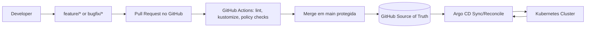
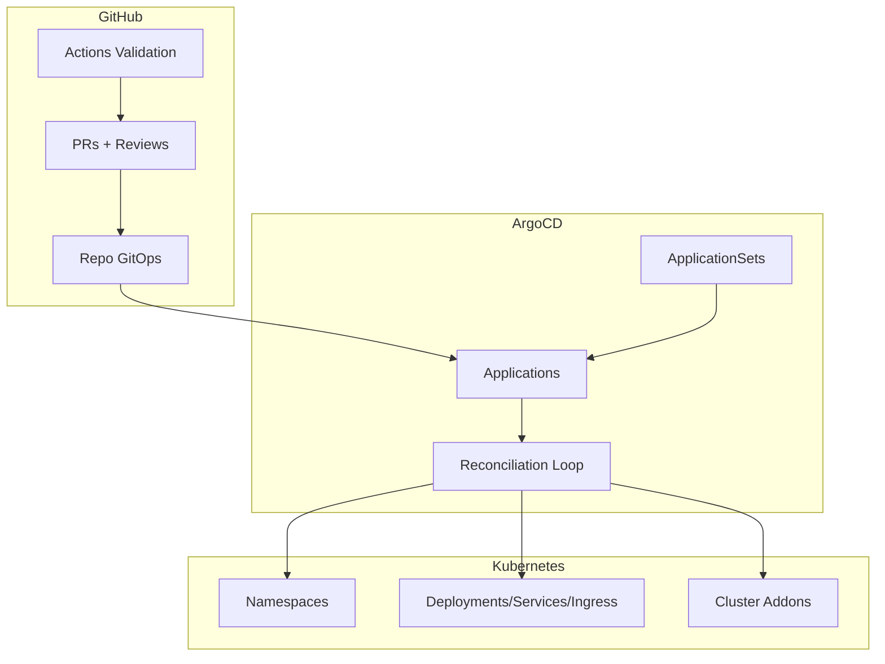
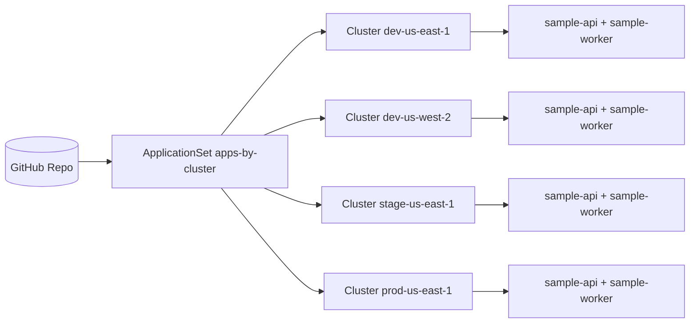

# GitOps Reference Repository (GitHub + Argo CD + ApplicationSet + Kustomize)

Repositório de referência para GitOps em Kubernetes com foco em clareza arquitetural, escalabilidade operacional e governança real de produção.

## Visão Geral

Este projeto implementa um fluxo GitOps completo em que:

- **GitHub é a fonte de verdade** (desired state).
- **Pull Requests são o mecanismo de mudança**.
- **GitHub Actions valida qualidade e conformidade**.
- **Argo CD reconcilia o estado no cluster**.
- **Kustomize organiza base/overlays por ambiente**.
- **ApplicationSet escala para múltiplas apps e clusters**.

> A CI **não aplica manifests** no cluster. Ela apenas valida. A reconciliação é responsabilidade do Argo CD.

## Objetivos

- Servir como referência pública de mercado para times de Platform/SRE/DevOps.
- Demonstrar promoção segura entre `dev`, `stage` e `prod` via PR.
- Demonstrar escala para single-cluster e multi-cluster.
- Fornecer estrutura reutilizável para catálogo GitOps.
- Maximizar auditabilidade, reprodutibilidade e segurança operacional.

## Posicionamento no ecossistema

Este repositorio deve ser lido como a referencia **generica e reutilizavel** de GitOps.

- `gitops`: referencia multiplataforma para GitHub + Argo CD + ApplicationSet + Kustomize.
- `argocd`: implementacao mais opinativa, focada em AWS/EKS, addons de plataforma e bootstrap operacional.

Na pratica:

- use `gitops` para golden paths, catalogos, estrutura e governanca;
- use `argocd` quando quiser uma stack mais integrada com EKS, observabilidade e operacao real da plataforma.

## Arquitetura do Fluxo GitOps

### 1) Fluxo do desenvolvedor até o cluster



### 2) Fluxo de promoção `dev -> stage -> prod`


### 3) Responsabilidade entre GitHub, Argo CD e Kubernetes



### 4) Multi-cluster com ApplicationSet



## Por Que GitOps com GitHub

- Histórico completo de alterações com autoria e revisão.
- Integração nativa com branch protection, rulesets e CODEOWNERS.
- Pull Request como controle de mudança e trilha de auditoria.
- Actions para validação contínua sem acoplamento com deploy imperativo.

## Por Que Argo CD

- Reconciliação contínua e visibilidade de drift.
- Modelo declarativo com Applications e ApplicationSets.
- Suporte forte a multi-cluster e rollback por commit revert.
- Excelente encaixe para estratégia App-of-Apps.

## Por Que Kustomize

- Sem templates complexos para cenários simples.
- Reuso limpo por `base` + `overlays`.
- Reduz duplicação mantendo customização por ambiente.
- Excelente integração com Argo CD.

## Estrutura do Repositório

```text
.
├── .github/
├── argocd/
├── apps/
├── clusters/
├── docs/
├── examples/
├── policies/
├── scripts/
├── CONTRIBUTING.md
├── GOVERNANCE.md
├── LICENSE
├── README.md
└── SECURITY.md
```

### Explicação por domínio

- `.github/`: workflows de validação, templates de PR/Issues, CODEOWNERS.
- `argocd/`: AppProjects, Applications e ApplicationSets.
- `apps/`: catálogo de workloads e addons com Kustomize.
- `clusters/`: entrypoint declarativo por cluster (root Application).
- `docs/`: guias de arquitetura, bootstrap, promoção e operação.
- `policies/`: regras formais de governança e segurança.
- `examples/`: cenários práticos para demonstração.
- `scripts/`: validações locais equivalentes ao CI.

## Fluxo de Promoção entre Ambientes

Resumo prático:

1. Alterar `overlays/dev` e validar.
2. Promover para `stage` por novo PR.
3. Promover para `prod` com aprovação humana.
4. Merge em `main` representa promoção.
5. Argo CD reconcilia o novo estado.

Guia completo: [`docs/promotion-flow.md`](docs/promotion-flow.md)

## Bootstrap do Ambiente

1. Instalar Argo CD no cluster alvo.
2. Atualizar `repoURL` placeholders para seu repositório.
3. Aplicar `clusters/<env>/<region>/root-application.yaml`.
4. Validar sync e health no Argo CD.

Guia completo: [`docs/bootstrap.md`](docs/bootstrap.md)

## Como Adicionar Uma Nova Aplicação

1. Criar `apps/<app-name>/base` com manifests mínimos.
2. Criar `apps/<app-name>/overlays/{dev,stage,prod}`.
3. Registrar no `ApplicationSet` (ou criar `Application` dedicada).
4. Abrir PR e validar workflows.
5. Promover por PR entre ambientes.

Se quiser partir de um esqueleto padronizado:

```bash
./scripts/create-app.sh --name payments-api --image ghcr.io/example-org/payments-api:0.1.0 --port 8080
```

Guia detalhado: [`docs/create-app.md`](docs/create-app.md)

## Como Adicionar Um Novo Cluster

1. Criar pasta `clusters/<env>/<region>/`.
2. Incluir `root-application.yaml`, `cluster-metadata.yaml`, `kustomization.yaml`.
3. Registrar cluster no Argo CD (`argocd cluster add ...`).
4. Aplicar labels de cluster (`gitops.argocd.io/managed=true`, `environment=...`).
5. Validar geração de apps via `apps-by-cluster`.

## Como Criar Um Novo Overlay

1. Duplicar padrão de `apps/<app>/overlays/dev`.
2. Ajustar `namespace`, `replicas`, `config` e `ingress`.
3. Garantir nome do ambiente válido (`dev`, `stage`, `prod`).
4. Validar com `scripts/render-kustomize.sh`.

## Governança

Este repositório implementa governança por:

- `CODEOWNERS` em paths críticos.
- Policies formais em `policies/`.
- Branch strategy (`feature/*`, `bugfix/*`, `hotfix/*`, `release/*`).
- Branch protection e rulesets no GitHub.
- Aprovação humana para produção.

Referências:

- [`policies/branch-strategy.md`](policies/branch-strategy.md)
- [`policies/promotion-policy.md`](policies/promotion-policy.md)
- [`policies/repository-guardrails.md`](policies/repository-guardrails.md)

## Workflows do GitHub Actions

- `yaml-lint.yml`: lint de YAML.
- `validate-kustomize.yml`: `kustomize build` + schema checks.
- `validate-manifests.yml`: estrutura, arquivos obrigatórios, naming e manifests Argo CD.
- `security-checks.yml`: secret scan + guardrail de paths críticos/prod.
- `release-docs.yml`: qualidade de documentação e links.

Todos geram resumo amigável no `GITHUB_STEP_SUMMARY`.

## Exemplos de Uso (Hands-on)

1. Single app em dev: `examples/single-app-single-cluster/`.
2. Promoção dev->stage->prod: `examples/promotion-dev-stage-prod/`.
3. Multi-app no mesmo cluster: `examples/multi-app-single-cluster/`.
4. Multi-cluster com ApplicationSet: `examples/multi-app-multi-cluster/`.
5. Catálogo de plataforma: `apps/platform-metrics-server/` + `examples/platform-addons/`.

## Cases Reais de Utilização Cobertos

1. Single app em dev.
2. Mesma app promovida para stage e prod.
3. Duas aplicações com padrão base/overlays.
4. Multi-cluster com ApplicationSet.
5. Repositório como catálogo GitOps da plataforma.
6. Adição de addon de plataforma (metrics-server, com padrão extensível para ingress-nginx/external-dns).
7. Rollback por reversão de commit.
8. Auditoria por histórico de Pull Requests.
9. Segregação por times com AppProjects.
10. Promoção controlada com aprovação manual em produção.

Detalhamento: [`docs/use-cases.md`](docs/use-cases.md)

## Troubleshooting Básico

- App `OutOfSync`: verificar diff no Argo e overlay alvo.
- Build quebrado: executar `scripts/render-kustomize.sh`.
- Falha de policy: revisar `policies/` e paths críticos alterados.
- Falha em produção: garantir label `prod-approved` quando exigido.

Guia operacional completo: [`docs/operations.md`](docs/operations.md)

## Segurança e Operação

- Não armazenar secrets reais.
- Usar placeholders + integração futura com External Secrets/Sealed Secrets/SOPS.
- Validar paths críticos com CODEOWNERS + checks obrigatórios.
- Promover produção somente com revisão humana.
- Preferir mudanças pequenas, reversíveis e auditáveis.

## Roadmap Futuro

- Integração com Helm para componentes complexos.
- Flux como engine alternativa de GitOps.
- Multi-tenant GitOps com boundaries mais rígidos.
- Policy as Code com OPA/Kyverno.
- Progressive delivery com Argo Rollouts.
- Integração EKS + IRSA para addons cloud-native.
- Preview environments por PR.

## Quick Start Local

```bash
# lint + structure + naming + kustomize + argocd manifest validation
./scripts/validate.sh

# visualizar árvore
./scripts/tree.sh
```

## Notas de Placeholder

Substitua os valores abaixo antes de usar em ambiente real:

- `https://github.com/your-org/your-gitops-repo.git`
- domínios exemplo: `*.platform.example.com`
- imagens exemplo: `ghcr.io/example-org/*`

---

Se você usar este repositório como base pública no GitHub, recomenda-se criar uma release inicial (`v0.1.0`) após ajustar placeholders e habilitar branch protection/rulesets.
